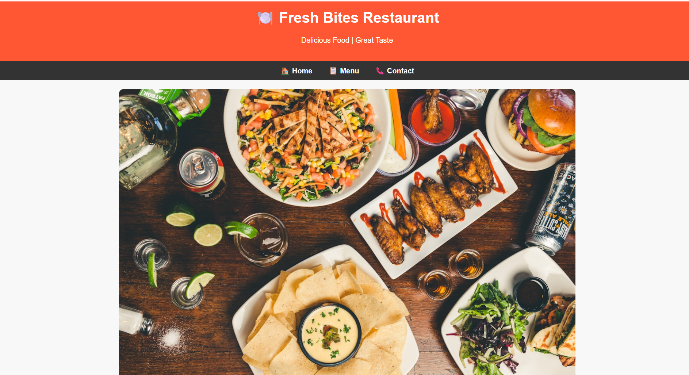

# Future_FS_03
Local Business Website developed using HTML, CSS and JavaScript to provide an online presence for a business. Created as Task 3 for the Future Interns Full Stack Web Development Internship.
# FUTURE_FS_03 – Local Business Website

This project is part of the **Future Interns Full Stack Web Development Internship**.

## Project Description
A professional website developed for a local business to help them establish an online presence and attract more customers.

## Features
• Home page introducing the business  
• About section describing the business  
• Services/Menu section  
• Contact page with business details  

## Technologies Used
HTML  
CSS  
JavaScript  

## Business Benefit
This website helps the business:
• Improve online visibility  
• Provide easy contact information  
• Showcase services or products to customers  
## Project Output

## Author
Bindu
